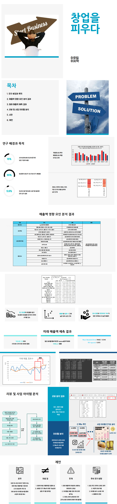

### 창업을 피우다 (이우림, 이지학)

#### 2021 피우다 프로젝트 우수상(2위) 수상

- - -

## 역할
* 이우림 : 데이터 상관 관계 분석, 회귀 분석, 시계열 분석 등을 통해 매출액 예상에 필요한 최종 feature 선정. 리뷰 데이터 크롤링.
  * 데이터 분석 진행한 내용에 관해 [간단하게 정리한 내용은 이 링크에서 확인가능](https://github.com/woorimlee/Blooming-business/blob/main/ipynb/%EB%8D%B0%EC%9D%B4%ED%84%B0_%EB%B6%84%EC%84%9D_%EC%9A%94%EC%95%BD.ipynb)하십니다.

* 이지학 : 시계열 분석, XGBoost를 이용한 미래 예상 매출액 도출, 크롤링 된 리뷰 데이터를 이용해 긍정, 부정 리뷰 분류.

## 프로젝트 내용

